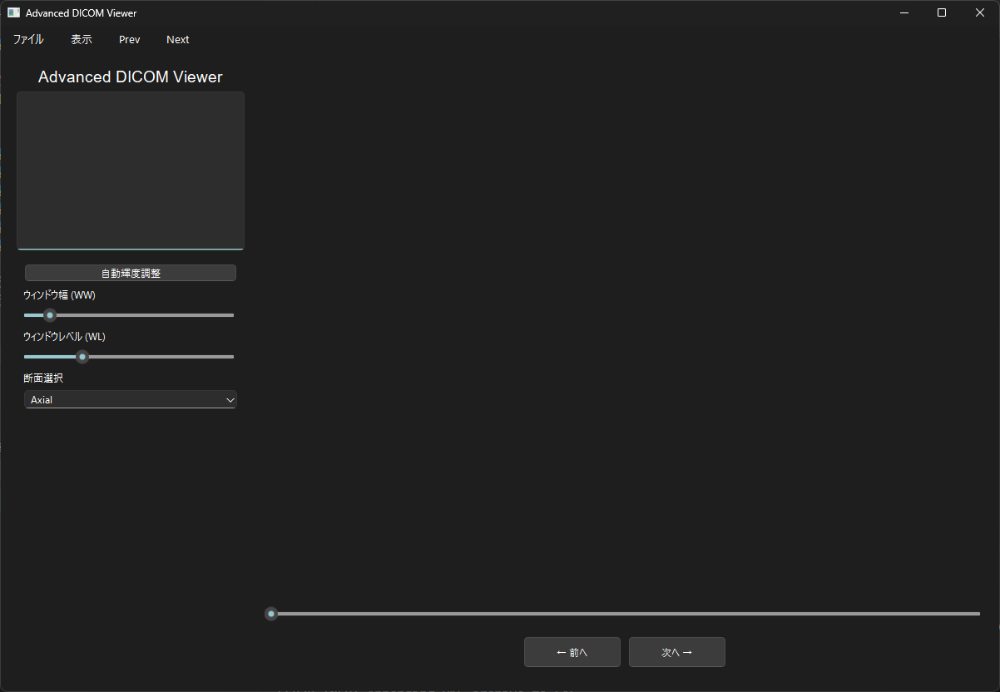
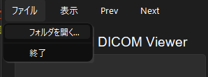
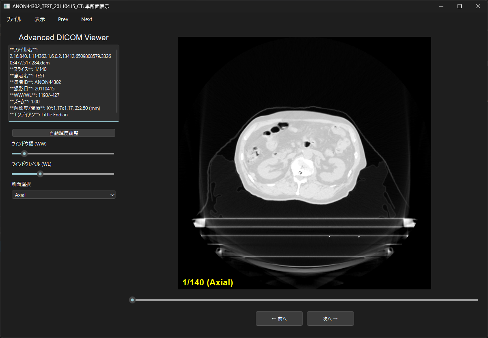
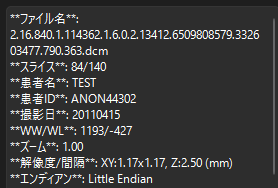
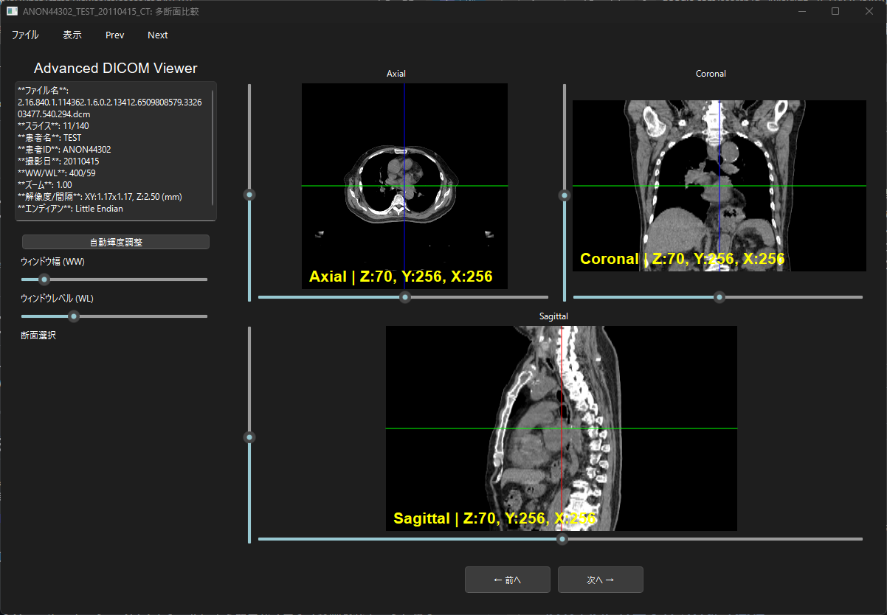

# Advanced DICOM Viewer
# ユーザーマニュアル（JP）

## ダウンロード・実行
### GitHubからコードをダウンロードし実行
[GitHub-ai10pro/ctmr_viewer](https://github.com/ai10pro/ctmr_viewer)からGitクローンを行う。

```bash
git clone https://github.com/ai10pro/ctmr_viewer.git
cd ctmr_viewer
```

クローン後、Pythonの仮想環境を構築し、```requirements.txt```から必要なパッケージをインストールする。

```bash
python -m venv .venv
.venv/Scripts/activate/Activate.psl
pip install -r requirements.txt
```
ルードディレクトリにいることを確認し、```viewer_release.py```を実行する。

```bash
python viewer_release.py
```
### GitHubReleaseからコードをダウンロードし実行
[GitHub-Release](https://github.com/ai10pro/ctmr_viewer/tree/v1.0.0)からソースまたはExeファイルをダウンロードする。

ソースの場合上記同様に仮想環境の構築と必要ライブラリのインストールを行い、実行することができます。

exeファイルの場合、exeファイルを実行することでアプリを起動することができます。

## 操作方法
### １．画像読み込み
起動後以下画像の画面になる。



画像の読み込みは上部メニューバーの[ファイル]>[フォルダを開く]からDICOMファイルを選択します。



読み込み成功後は次の画像のようになります。


### ２．画像の表示設定(単断面表示)
画像読み込み成功後、画像下部にあるスライダーにてスライスを変更できます。また、マウスホイールで10枚送りの調節ができるほか、画面下部に設置してるボタンで1枚ずつスライスを変更することができます。

画面左側ではDICOＭファイル情報の表示がされます。



また、ファイル情報下にはウィンドウ幅とウィンドウレベルを指定するスライダーがあり、断面選択肢としてAxial、Coronal、Sagittalを変更すると同時に画面右側の画像にてその結果が表示されます。


### ３．画像の表示設定(複数断面比較)
上部メニューの[表示]>[多断面比較]よりAxial、Coronal、Sagittalの三画面を比べながら表示することができる画面になります。
また、前述の単断面表示では多断面比較の上に配置されているボタンから切り替えることができます。




この表示画面では単断面表示同様、ウィンドウレベルウィンドウ幅の変更のほか、画像ごとに縦と横のスライダーが設置されている。

それぞれ画像内に表示される線と対応しており、その線に合わせたスライスがAxial、Coronal、Sagittalで行われる。

### ４．DICOMヘッダーの表示
上部メニューの[表示]>[DICOMヘッダー全体を表示]から画像に示すようなヘッダー情報一覧が新規ウィンドウで立ち上がります。ただし、この機能はAxial画像に対応しており、単断面表示の場合Axial設定の時のみ表示可能です。


## WW,WLの調節について
ウィンドウレベルウィンドウ幅を適切に調節することにより、必要な臓器などを明瞭に見ることができます。

全体としてウィンドウレベルは低めに設定し、ウインドウ幅にて調節するのが良いとされています。

また、本アプリの特徴として画像内でドラックアンドドロップをすることでウィンドウ幅、ウィンドウレベルを変更することができます。